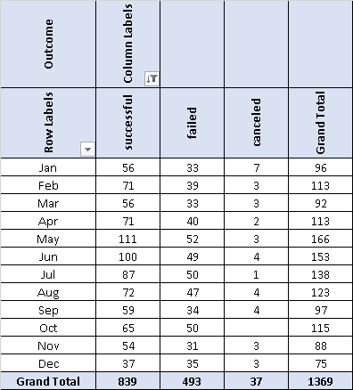
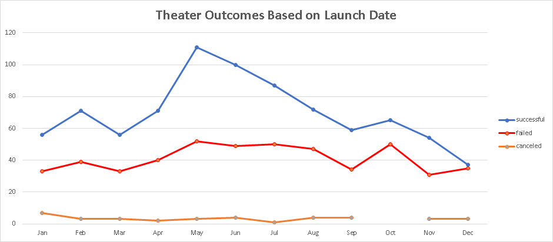
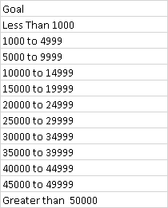
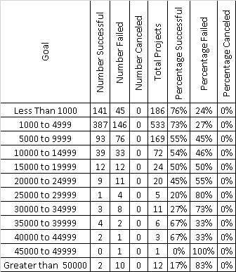
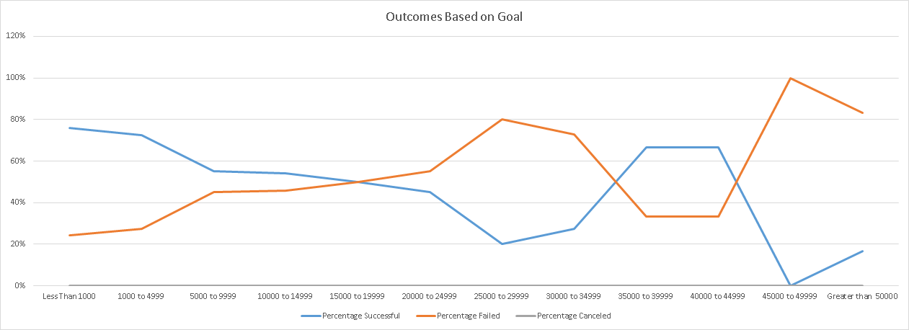

# **<u>K i c k s t a r t e r   C a m p a i g n   A n a l y s i s</u>**

### <u>Project Overview</u>

This report has been prepared to describe the process utilized to provide the insights requested by our client, Louise.  She launched a Kickstarter campaign that failed but was nearly successful.  Because of this she is interested in having some statistical insight into other campaigns to see how successful they were and how that relates to their launch date and the amount of their fundraising goal.  More specifically described below in the list of deliverables.

1. Expose the relationship between **Theater Kickstarter Campaigns and launch date**.
2. Expose the relationship between **Play Kickstarter Campaigns and fundraising goal amount**.
3. A final report that clearly communicates the work performed, challenges, results and observations (This document).

In the following sections you will find detail about the work performed and the results.

### <u>Analysis and Challenges</u>

The relationships for the first two deliverables were exposed utilizing an Excel Pivot Table, a Range Table and Charts to transformations, analyze and visualize a dataset containing Kickstarter campaign statistics between 2009 and 2017 (the dataset).  

####  Process for Launch Date Analysis

The value in the field "launched_at" was converted from Unix timestamps to a more readable format using the following formula. 

 `=((([launched_at]/60)/60)/24)+DATE(1970,1,1)`

The result was used to populate a new field in the table which was named "Date Created Conversion".  This step was required in order to be able to filter the data by launch month.  At this point the dataset was used to create a pivot table (table 1).  Table 1 was filtered to show only "Theater" campaigns and the "live" campaigns were filtered out, the result is illustrated below.  Successful, failed and canceled campaigns are counted and summed by month.

The chart (Chart 1) below was created using table 1 to show a view of the dataset that is focused on how successful Theater campaigns were month to month from 2009 to 2017.

#### Process for Fundraising Goal Analysis

A new table (table 2) was created containing "Funding Goal" value ranges spanning from 0 to 50,000 or greater.  The ranges incremented at an interval of 5000 as shown below.

These ranges and the Excel function  `CountIFS()` was used to update table 2 with values representing the count of Successful, Failed and Canceled "Plays" campaigns within each range.  Those totals were summed by range and a percentage was calculated.

The chart (Chart 2) below was created using the ranges and percentages from table 2 to show a view of the dataset that is focused on the percentage and success of "Play" campaigns in each range from 2009 to 2017.

#### Challenges

* The two studies focus on two different levels of precision, Parent Category and subcategory.  It would be interesting to see both studies done at both levels.

* We are comparing 13 different currencies as if they are all equivalent.  A currency conversion table or field could be incorporated to improve the accuracy of the results in the Funding Goals analysis.

  

### <u>Results</u>

#### Outcomes of Analysis Based on Launch Date

The results can be visualized in the chart 1.

* The data shows that "Theater" campaigns starting in May are more likely to succeed.  The best range of time to start a "Theater" campaign is from May to July.

* Alternately the worst time to start a "Theater" campaign is in December.  The worst ranges being from Jan to April and August to December.

  

#### Outcomes of Analysis Based on Goals

The results can be visualized in the chart 2.

* Here, the data shows that lower Fundraising Goals for "Plays" campaigns are more likely to succeed.  The data shows a downward trend as the Fundraising goal increases.  There are anomalies in the data between 35000 and 45000 that should be looked at more closely to see if it is an outlier in the data.

* None of the "Plays" campaigns were canceled in the time range that was analyzed.

  

#### Limitations of the Data

* The data covers a relatively short time range.
* The currency in the data is not normalized, so the goal amounts are not equivalent.
* The regions included in the table are low resolution, they are only by country.

#### Opportunities to improve the results

* Include a way to normalize the currency values.

* Using a trend line for funding could improve and communicate the results more clearly.

- The chart color specifications from the assignment are not intuitive and in the case of the Goals study "Canceled" is invisible.  Some thought should be put into formatting for the charts.
- Perform both studies at Parent Category and subcategory level.
